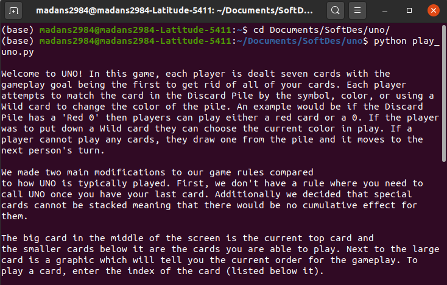
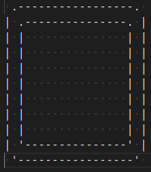
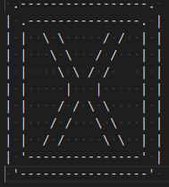
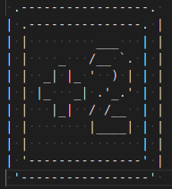
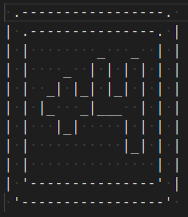
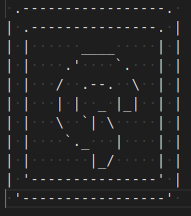
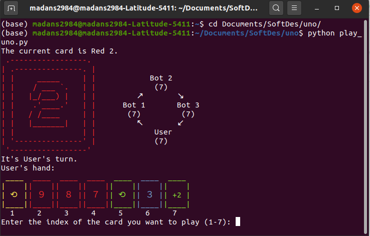

## Game Overview

 

### Rules

The game has 112 cards (see the breakdown [here](cards.md)). Each player is dealt seven cards with the gameplay goal being the first to get rid of all of your cards. Each player attempts to match the card in the Discard Pile by the symbol, color, or using a Wild card to change the color of the pile. An example would be if the Discard Pile has a "Red 0" then players can play either a red card or a 0. If the player was to put down a Wild card they can choose the current color in play. If a player cannot play any cards, they draw one from the pile and it moves to the next person's turn.

There are a few special cards which have actions associated with them.     
      
    - The Wild card allows the player to change the color in play.       
      
    - The Skip card skips the next player's turn.      
     
    - The Plus 2 card has the next player draw 2 cards and skips their turn.     
      
    - The Wild Plus 4 card has the next player draw 4 cards and skips their turn. It also allows the current player to change the color in play.     
      
    - The Reverse card reverses the order of game play.        

We made two main modifications to our game rules compared to how UNO is typically played. First, we don't have a rule where you need to call UNO once you have your last card. That rule relies on human observation and when playing with bots it doesn't make as much sense. Additionally we decided that special cards cannot be stacked meaning that there would be no cumulative effect for them.

To start the game, the top card in the Draw Pile is flipped over. If that card is an Action card, it's shuffled back in and the steps repeat until a non-Action card is pulled to be the starting card. This is the starting card of the Discard Pile and the gameplay starts from there.

### Game Demo

### Game Visualizations
 
We chose to create our game with a command line interface so we created our own visualizations for each card. 

For the current card in play, we created ASCII images for each card and then used different color codes to determine which color to display. For the cards in the hand, we used unicode characters for each of the centers and created a border around it. Everything we visualized was created using different characters including the game play graphic which shows the current turn order and number of cards in each player's hands. 

When we created our visualizations, we realised that it was difficult to tell when one turn ended and the next began so we added a border which made it easier for players to distinguish individual turns.